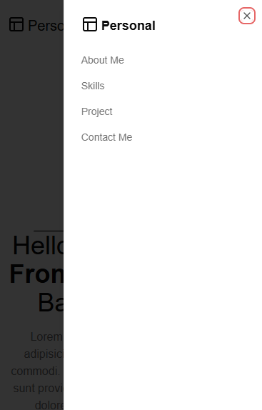
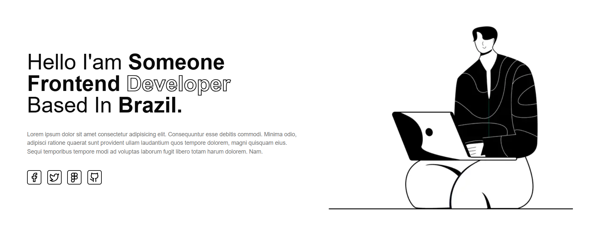
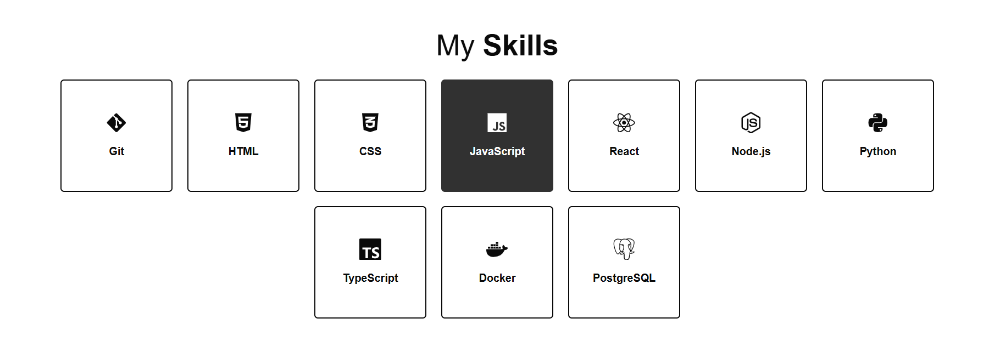
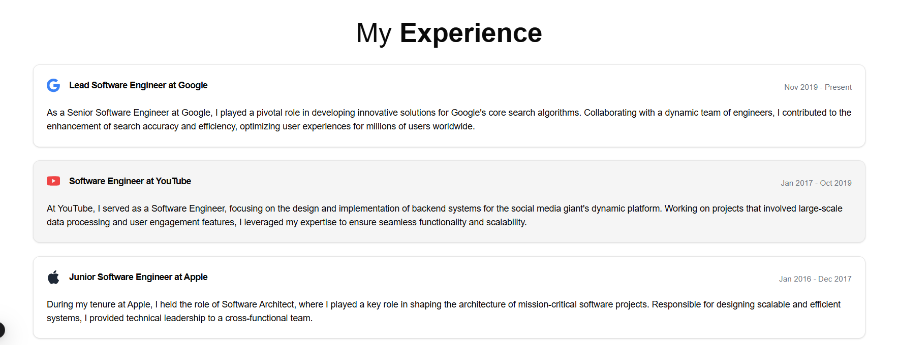

# Como Instalar o TailwindCSS em Diferentes Ambientes

## Índice

- [Instalando o TailwindCSS em um Projeto Next.js](#1-instalando-o-tailwindcss-em-um-projeto-nextjs)
- [Instalando o TailwindCSS em um Projeto Vite](#2-instalando-o-tailwindcss-em-um-projeto-vite)
- [Instalando o TailwindCSS em um Projeto HTML Simples](#3-instalando-o-tailwindcss-em-um-projeto-html-simples)
- [Outras Formas de Usar o TailwindCSS](#4-outras-formas-de-usar-o-tailwindcss)
- [O Que São @tailwind base;, @tailwind components; e @tailwind utilities;](#5-o-que-são-tailwind-base-tailwind-components-e-tailwind-utilities)
- [Explicação dos Arquivos Criados](#6-explicação-dos-arquivos-criados)
- [Possibilidades do tailwindconfigjs](#7-possibilidades-do-tailwindconfigjs)
- [Tutorial de Implementação: Portfólio Frontend Monocromático com TailwindCSS e Next.js](#-tutorial-de-implementação-portfólio-frontend-monocromático-com-tailwindcss-e-nextjs)

Este guia cobre a instalação do TailwindCSS em três ambientes comuns: Next.js, Vite e projetos HTML simples, além de apresentar outras formas de utilizar o TailwindCSS.

## 1. Instalando o TailwindCSS em um Projeto Next.js

### Passo 1: Inicialize um Projeto Next.js

Se ainda não tiver um projeto Next.js, crie um. Aceite todas as configurações padrão ao ser questionado durante a inicialização:

```bash
npx create-next-app@latest meu-projeto
cd meu-projeto
```

### Passo 2: Execute o Servidor de Desenvolvimento

O TailwindCSS já estará configurado automaticamente. Basta iniciar o servidor para verificar a configuração:

```bash
npm run dev
```

## 2. Instalando o TailwindCSS em um Projeto Vite

### Passo 1: Inicialize um Projeto Vite

Crie um novo projeto com Vite:

```bash
npm create vite@latest meu-projeto
cd meu-projeto
npm install
```

### Passo 2: Instale o TailwindCSS

Adicione o TailwindCSS e suas dependências:

```bash
npm install -D tailwindcss postcss autoprefixer
npx tailwindcss init -p
```

### Passo 3: Configure o `tailwind.config.js`

Edite o arquivo `tailwind.config.js` para incluir os caminhos dos seus arquivos:

```javascript
/** @type {import('tailwindcss').Config} */
module.exports = {
  content: ["./index.html", "./src/**/*.{js,ts,jsx,tsx}"],
  theme: {
    extend: {
      colors: {
        primary: "#1E40AF",
        secondary: "#F59E0B",
      },
      spacing: {
        72: "18rem",
        84: "21rem",
        96: "24rem",
      },
      fontFamily: {
        sans: ["Inter", "ui-sans-serif", "system-ui"],
        serif: ["Merriweather", "serif"],
        mono: ["SFMono-Regular", "Menlo", "monospace"],
      },
    },
  },
  plugins: [],
};
```

### Passo 4: Configure o Arquivo CSS

No diretório `src`, crie um arquivo `index.css` e adicione:

```css
@tailwind base;
@tailwind components;
@tailwind utilities;
```

Importe o CSS no seu arquivo `main.js` ou `main.ts`:

```javascript
import "./index.css";
```

### Passo 5: Execute o Servidor de Desenvolvimento

Inicie o servidor para verificar sua configuração:

```bash
npm run dev
```

## 3. Instalando o TailwindCSS em um Projeto HTML Simples

### Passo 1: Crie os Arquivos do Projeto

Crie a estrutura de arquivos:

```
projeto-html/
|-- index.html
|-- styles.css
```

### Passo 2: Instale o TailwindCSS com NPM

No diretório do projeto, inicialize o NPM:

```bash
npm init -y
npm install -D tailwindcss postcss autoprefixer
npx tailwindcss init
```

### Passo 3: Configure o `tailwind.config.js`

Edite o arquivo `tailwind.config.js` para incluir o caminho do seu HTML:

```javascript
/** @type {import('tailwindcss').Config} */
module.exports = {
  content: ["./index.html"],
  theme: {
    extend: {},
  },
  plugins: [],
};
```

### Passo 4: Configure o Arquivo CSS

No arquivo `styles.css`, adicione:

```css
@tailwind base;
@tailwind components;
@tailwind utilities;
```

### Passo 5: Gere o CSS Final

Execute o comando para gerar o arquivo CSS:

```bash
npx tailwindcss -i ./styles.css -o ./dist/output.css --watch
```

Inclua o CSS gerado no seu `index.html`:

```html
<!DOCTYPE html>
<html lang="en">
  <head>
    <meta charset="UTF-8" />
    <meta name="viewport" content="width=device-width, initial-scale=1.0" />
    <title>TailwindCSS</title>
    <link href="./dist/output.css" rel="stylesheet" />
  </head>
  <body>
    <h1 class="text-3xl font-bold underline">Hello, TailwindCSS!</h1>
  </body>
</html>
```

### Passo 6: Teste o Projeto

Abra o arquivo `index.html` em um navegador para conferir o resultado.

## 4. Outras Formas de Usar o TailwindCSS

### Usando um CDN

Se você deseja testar rapidamente o TailwindCSS sem configurá-lo, pode usar o Play CDN. Ele é ideal para desenvolvimento rápido no navegador, mas não é recomendado para produção.

#### Adicionar o Play CDN ao HTML

Inclua o script do Play CDN no `<head>` do seu HTML:

```html
<!doctype html>
<html>
  <head>
    <meta charset="UTF-8" />
    <meta name="viewport" content="width=device-width, initial-scale=1.0" />
    <script src="https://cdn.tailwindcss.com"></script>
  </head>
  <body>
    <h1 class="text-3xl font-bold underline">Hello world!</h1>
  </body>
</html>
```

#### Customizar Configurações com o Play CDN

Você pode personalizar o tema diretamente no HTML usando o objeto `tailwind.config`:

```html
<!doctype html>
<html>
  <head>
    <meta charset="UTF-8" />
    <meta name="viewport" content="width=device-width, initial-scale=1.0" />
    <script src="https://cdn.tailwindcss.com"></script>
    <script>
      tailwind.config = {
        theme: {
          extend: {
            colors: {
              clifford: "#da373d",
            },
          },
        },
      };
    </script>
  </head>
  <body>
    <h1 class="text-clifford text-3xl font-bold underline">Hello world!</h1>
  </body>
</html>
```

#### Adicionar Custom CSS com o Play CDN

Use o atributo `type="text/tailwindcss"` para incluir CSS personalizado que aproveite os recursos do Tailwind:

```html
<!doctype html>
<html>
  <head>
    <meta charset="UTF-8" />
    <meta name="viewport" content="width=device-width, initial-scale=1.0" />
    <script src="https://cdn.tailwindcss.com"></script>
    <style type="text/tailwindcss">
      @layer utilities {
        .content-auto {
          content-visibility: auto;
        }
      }
    </style>
  </head>
  <body>
    <div class="lg:content-auto">
      <!-- ... -->
    </div>
  </body>
</html>
```

#### Usar Plugins com o Play CDN

Adicione plugins de primeira linha usando o parâmetro de consulta `plugins` na URL do script:

```html
<!doctype html>
<html>
  <head>
    <meta charset="UTF-8" />
    <meta name="viewport" content="width=device-width, initial-scale=1.0" />
    <script src="https://cdn.tailwindcss.com?plugins=forms,typography,aspect-ratio,line-clamp,container-queries"></script>
  </head>
  <body>
    <div class="prose">
      <!-- ... -->
    </div>
  </body>
</html>
```

### Usando Frameworks CSS

Você pode usar TailwindCSS junto com frameworks CSS como Bootstrap ou Materialize para aproveitar o melhor de ambos. Basta configurar o Tailwind para evitar conflitos de classes usando o `prefix` no arquivo `tailwind.config.js`:

```javascript
module.exports = {
  prefix: "tw-",
  content: ["./src/**/*.{html,js}"],
  theme: {
    extend: {},
  },
  plugins: [],
};
```

Assim, as classes Tailwind terão o prefixo `tw-` (por exemplo, `tw-text-center`).

## 5. O Que São `@tailwind base;`, `@tailwind components;` e `@tailwind utilities;`?

Essas diretivas são usadas para incluir as diferentes partes do TailwindCSS no seu projeto:

- **`@tailwind base;`**: Inclui os estilos base do TailwindCSS, como resets de CSS e estilos globais.
- **`@tailwind components;`**: Adiciona as classes utilitárias para componentes reutilizáveis, como botões ou cards.
- **`@tailwind utilities;`**: Fornece as classes utilitárias para estilização rápida, como `text-center`, `bg-blue-500`, etc.

Você pode reorganizar ou omitir essas diretivas dependendo do que é necessário no seu projeto.

## 6. Explicação dos Arquivos Criados

### Arquivo `tailwind.config.js`

Este é o arquivo de configuração principal do TailwindCSS. Nele, você define quais arquivos do projeto devem ser analisados para gerar as classes CSS necessárias. Também permite personalizar o tema, adicionar plugins e outras configurações avançadas.

### Arquivo `styles.css`

Este arquivo contém as diretivas `@tailwind base;`, `@tailwind components;` e `@tailwind utilities;`, que incluem os estilos do TailwindCSS no seu projeto. É o ponto de entrada para o CSS gerado.

### Diretório `dist/output.css`

Este é o arquivo CSS final gerado pelo TailwindCSS, que contém apenas as classes utilizadas no seu projeto. Ele é gerado durante o processo de build ou usando o comando `npx tailwindcss`.

### Arquivo `index.html` (em projetos HTML simples)

Este é o arquivo HTML principal que referencia o CSS gerado. Ele demonstra como utilizar as classes do TailwindCSS diretamente em elementos HTML.

### Arquivo `main.js` ou `main.ts` (em projetos Vite)

Esse arquivo é o ponto de entrada do JavaScript do projeto. Nele, você importa o arquivo `index.css`, garantindo que os estilos do TailwindCSS sejam aplicados.

## 7. Possibilidades do `tailwind.config.js`

O arquivo `tailwind.config.js` é altamente configurável e permite:

### Personalizar o Tema

Você pode adicionar cores, espaçamentos, fontes e muito mais à sua configuração de tema:

```javascript
theme: {
  extend: {
    colors: {
      primary: '#1E40AF',
      secondary: '#F59E0B',
    },
    spacing: {
      '72': '18rem',
      '84': '21rem',
      '96': '24rem',
    },
  },
},
```

### Adicionar Plugins

Você pode incluir plugins oficiais ou personalizados para estender as funcionalidades do TailwindCSS:

```javascript
plugins: [
  require('@tailwindcss/forms'),
  require('@tailwindcss/typography'),
  require('@tailwindcss/aspect-ratio'),
],
```

### Configurar Prefixos

Evite conflitos com outras bibliotecas adicionando um prefixo a todas as classes:

```javascript
prefix: 'tw-',
```

### Controlar o Purge

Defina os arquivos que serão analisados para remover CSS não utilizado (tree-shaking):

```javascript
content: [
  './src/**/*.{html,js,jsx,ts,tsx}',
  './public/index.html',
],
```

Com essas configurações, você pode adaptar o TailwindCSS às necessidades específicas do seu projeto, tornando-o mais eficiente e personalizado.

### 📝 Tutorial de Implementação: Portfólio Frontend Monocromático com TailwindCSS e Next.js

#### 1. Descrição do Objetivo

O objetivo deste projeto foi demonstrar como utilizar **TailwindCSS** em conjunto com o **Next.js** para criar uma página de portfólio monocromática voltada para desenvolvedores frontend. O design, baseado em um projeto do Figma, foi escolhido por sua simplicidade, facilitando a aplicação de variáveis de cores e responsividade. Além disso, utilizamos a biblioteca **shadcn/ui** para adicionar componentes reutilizáveis e estender funcionalidades diretamente no **TailwindCSS**.
[Link do figma](<https://www.figma.com/design/0Wah6L1U9VQqcWuF0cyFU8/Illustration-Based-Portfolio-Website-Template-(Community)?m=auto&t=0XIpTwkQNzmj2RLf-6>)

#### 2. Configuração Inicial e Instalação

Foi criado o repositório do zero para o inicio do desenvolvimento.

##### Passos para Configuração:

1. **Criação do Repositório**: No GitHub

   - Criem um novo repositório vazio e cliquem em "Criar".
   - Após isso, configurem o repositório localmente:

```bash
		git init git remote add origin <URL_DO_REPOSITORIO>
```

2. **Inicialização de um Projeto Next.js**: Executem o comando abaixo para iniciar o projeto e aceitando as opções padrões do Next.js:

   ```bash
       npx create-next-app@latest <NomeDoProjeto>
   ```

````

    Isso criará a estrutura inicial do projeto Next.js.

5. **Instalamos o shadcn/ui**: O **shadcn/ui** foi adicionado para criar/utilizar componentes estilizados e reutilizáveis. Para configurá-lo:

```shell
	    npx shadcn init
````

    Durante a inicialização, os estilos e temas foram automaticamente integrados ao `tailwind.config.js`.
    mudamos o tema conforme o design do figma

---

#### 3. Passo-a-Passo do Desenvolvimento

##### 3.1 Estrutura do Projeto

O projeto foi dividido entre os membros da equipe, que ficaram responsáveis por diferentes seções:

- **Menu e Hero**: Gabriel
- **Skills**: Wender
- **Experiências**: José

##### 3.2 Componentes Desenvolvidos

Aqui estão os principais componentes criados:

- **Menu Responsivo**  
   O menu foi projetado para ser funcional e responsivo, utilizando o componente `Sheet` do **shadcn/ui** para o menu móvel.
  **Arquivo**: `menuMobile.tsx`

```tsx
import {
  Sheet,
  SheetContent,
  SheetDescription,
  SheetHeader,
  SheetTitle,
  SheetTrigger,
} from "@/components/ui/sheet";
import { Menu, PanelsTopLeft } from "lucide-react";

export function MenuMobile() {
  return (
    <Sheet>
      <SheetTrigger className="block lg:hidden">
        <Menu />
      </SheetTrigger>
      <SheetContent>
        <SheetHeader>
          <SheetTitle className="flex">
            <PanelsTopLeft className="mr-1" />
            <p>Personal</p>
          </SheetTitle>
          <SheetDescription className="text-left">
            <ul className="mt-4 space-y-4">
              <li>About Me</li>
              <li>Skills</li>
              <li>Project</li>
              <li>Contact Me</li>
            </ul>
          </SheetDescription>
        </SheetHeader>
      </SheetContent>
    </Sheet>
  );
}
```

- **Hero**  
   Gabriel criou a seção inicial da página, que inclui uma introdução com uma imagem e ícones de redes sociais estilizados.
  **Arquivo**: `hero.tsx`
- **Skills**  
   A seção de Skills foi desenvolvida utilizando o componente `CardSkill` para criar cartões interativos para cada habilidade.
  **Arquivo**: `skills.tsx`

```tsx
import {
  FaGitAlt,
  FaHtml5,
  FaCss3Alt,
  FaJs,
  FaReact,
  FaNodeJs,
  FaPython,
  FaDocker,
} from "react-icons/fa";
import { SiTypescript, SiPostgresql } from "react-icons/si";
import { CardSkill } from "../cardSkill";

export function Skills() {
  const skills = [
    { name: "Git", icon: FaGitAlt },
    { name: "HTML", icon: FaHtml5 },
    { name: "CSS", icon: FaCss3Alt },
    { name: "JavaScript", icon: FaJs },
    { name: "React", icon: FaReact },
    { name: "Node.js", icon: FaNodeJs },
    { name: "Python", icon: FaPython },
    { name: "TypeScript", icon: SiTypescript },
    { name: "Docker", icon: FaDocker },
    { name: "PostgreSQL", icon: SiPostgresql },
  ];

  return (
    <section className="mt-4 p-4 lg:p-12">
      <h2 className="mb-8 text-center text-4xl lg:text-5xl">
        My <span className="font-bold">Skills</span>
      </h2>
      <div className="mt-6 flex flex-wrap justify-center gap-6">
        {skills.map((skill, index) => {
          const Icon = skill.icon;
          return (
            <CardSkill
              key={index}
              className={`${
                index > 5 ? "hidden sm:flex" : "flex"
              } flex-col items-center justify-center`}
            >
              <Icon className="text-4xl" />
              <p className="text-center text-lg font-semibold">{skill.name}</p>
            </CardSkill>
          );
        })}
      </div>
    </section>
  );
}
```

- **Experiências**  
   Os cartões de experiências, criados por José, apresentam o histórico profissional de maneira estilizada.

```tsx
import { BsGoogle, BsYoutube, BsApple } from "react-icons/bs";
import {
  Card,
  CardContent,
  CardDescription,
  CardHeader,
  CardTitle,
} from "../ui/card";

export function Experience() {
  return (
    <section className="mt-4 p-4 lg:px-24">
      <h2 className="mb-8 text-center text-4xl lg:text-5xl">
        My <span className="font-bold">Experience</span>
      </h2>

      <Card className="mb-6">
        <CardHeader className="flex flex-col lg:flex-row">
          <CardTitle className="flex items-center space-x-4">
            <BsGoogle className="text-2xl text-blue-500" />
            <span>Lead Software Engineer at Google</span>
          </CardTitle>
          <CardDescription className="text-sm text-gray-500 lg:ml-auto">
            Nov 2019 - Present
          </CardDescription>
        </CardHeader>
        <CardContent>
          As a Senior Software Engineer at Google, I played a pivotal role in
          developing innovative solutions for Google&apos;s core search
          algorithms. Collaborating with a dynamic team of engineers, I
          contributed to the enhancement of search accuracy and efficiency,
          optimizing user experiences for millions of users worldwide.
        </CardContent>
      </Card>

      <Card className="bg-muted mb-6">
        <CardHeader className="flex flex-col lg:flex-row">
          <CardTitle className="flex items-center space-x-4">
            <BsYoutube className="text-2xl text-red-500" />
            <span>Software Engineer at YouTube</span>
          </CardTitle>
          <CardDescription className="text-sm text-gray-500 lg:ml-auto">
            Jan 2017 - Oct 2019
          </CardDescription>
        </CardHeader>
        <CardContent>
          At YouTube, I served as a Software Engineer, focusing on the design
          and implementation of backend systems for the social media
          giant&apos;s dynamic platform. Working on projects that involved
          large-scale data processing and user engagement features, I leveraged
          my expertise to ensure seamless functionality and scalability.
        </CardContent>
      </Card>

      <Card>
        <CardHeader className="flex flex-col lg:flex-row">
          <CardTitle className="flex items-center space-x-4">
            <BsApple className="text-2xl text-gray-800" />
            <span>Junior Software Engineer at Apple</span>
          </CardTitle>
          <CardDescription className="text-sm text-gray-500 lg:ml-auto">
            Jan 2016 - Dec 2017
          </CardDescription>
        </CardHeader>
        <CardContent>
          During my tenure at Apple, I held the role of Software Architect,
          where I played a key role in shaping the architecture of
          mission-critical software projects. Responsible for designing scalable
          and efficient systems, I provided technical leadership to a
          cross-functional team.
        </CardContent>
      </Card>
    </section>
  );
}
```

---

#### 4. Imagens do Processo

Aqui estão algumas capturas de tela do projeto:

- **Menu Responsivo (Mobile)**:
  
- **Hero Section**:
  
- **Skills**:
  

- **Experiências**:
  
